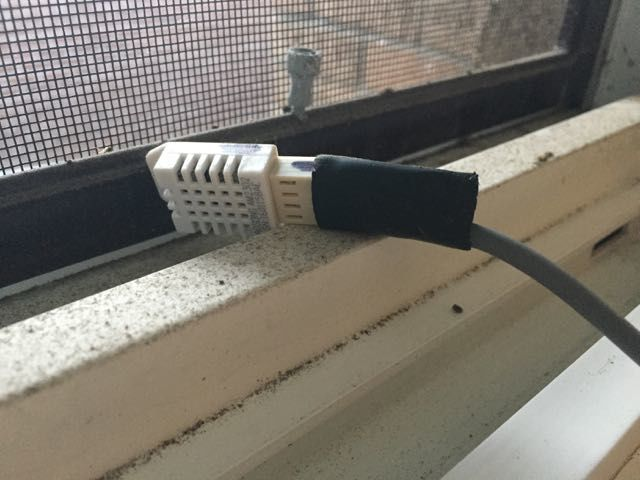
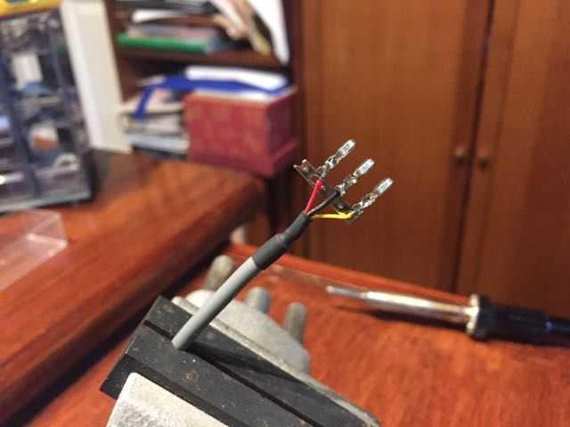
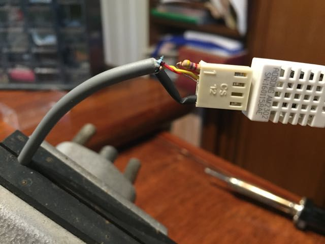
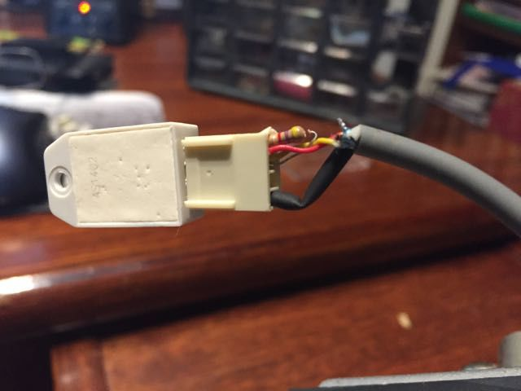
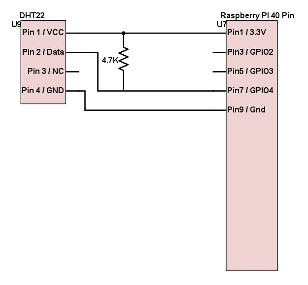
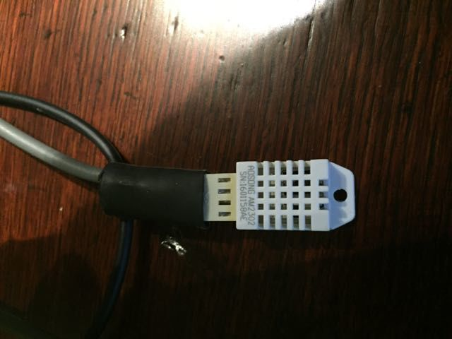

# homebridge-dht build

I was looking for a low cost temperature / humidity sensor I could use to monitor what is happening in my crawlspace, as I found that this spring it was very wet, and had a lot of damp. So I was looking for a reasonably priced sensor that I could put down there, and monitor remotely. After doing some digging on the net for what was available locally and shown to work with a RaspBerry PI and a NodeMCU ( more on this later ). I decided on a DHT22 Sensor. It was cheap, offered both temperature and humididty and available locally.



Update December 2016 - After running these for a few months, I have found that the accuracy of the humidity sensor varies greatly over time and have stopped trusting these for reasonably accurate humidty information. And am changing all my devices over to the Bosch BME280 Temperature/Humidity/Barometric Pressure sensor. So I have created a new instructable showing how to connect this sensor to the RaspberryPI ( Connect Your RaspberryPI to the BME280 Temperature and NodeMCU/ESP8266 ( Homebridge-MCUIOT ).

<!--ts-->
   * [homebridge-dht build](#homebridge-dht-build)
   * [Step 1: Parts List](#step-1-parts-list)
   * [Step 2: Prepare the RPI End of the Cable](#step-2-prepare-the-rpi-end-of-the-cable)
   * [Step 3: Sensor End of the Cable](#step-3-sensor-end-of-the-cable)
   * [Step 4: Connecting the Cables](#step-4-connecting-the-cables)
   * [Step 5: Installing the Homebridge Software](#step-5-installing-the-homebridge-software)
   * [Step 6: Install Homebridge-dht](#step-6-install-homebridge-dht)
   * [Step 7: Installing BCM2835 Library](#step-7-installing-bcm2835-library)
   * [Step 8: Raspberry PI CPU Temperature Monitoring - Optional](#step-8-raspberry-pi-cpu-temperature-monitoring---optional)
   * [Step 9: Start Homebridge](#step-9-start-homebridge)
   * [Step 10: Testing With Home Kit](#step-10-testing-with-home-kit)
   * [Step 11: Bonus Chapter - Dual Sensors](#step-11-bonus-chapter---dual-sensors)

<!-- Added by: sgracey, at:  -->

<!--te-->

# Step 1: Parts List

So I went to my local parts store, and purchased

```
1 - DHT22 / AM2303 Temperature / Humidity Sensor
1 - 4.7K Resistor
4 Pin Female header ( Sensor side )
5 Pin Female header ( RPI Side )

Heatshrink tubing narrow, and wide
Old serial mouse
```

To wire the sensor to PI, I used the cable from an old serial mouse I had lying around. Any used cable could be used, as long at it has 3 wires. The one I used had a couple of wires, but I used the Red, Yellow and Black to keep things simple.

# Step 2: Prepare the RPI End of the Cable



I then soldered the pins to my wire. The pins I had were crimp ones, but I couldn't get them to crimp correctly, so I went with solder instead.

After soldering the pins, I then inserted them into the 5 Pin Female header, with the Red in 1, Yellow in 4, and Black in 5.

RPI Connection is wired like this

```
RPI -> 5 Pin Header -> Description -> Wire Colour

1 -> 1 -> 3.3 VDC Power -> Red
7 -> 4 -> GPIO4 -> Yellow
9 -> 5 -> Ground -> Black
```

# Step 3: Sensor End of the Cable



At this end we use the 4 Pin female header, the resistor and the heat shrink tubing.



Solder the red and yellow wires each to a pin, and put the resistor between them as well. Also cover these with heat shrink so you don't get a short. Then solder the black wire to a pin as well. Insert the pins into the 4 Pin header as follows



```
1 - Red
2 - Yellow
3 - Empty
4 - Black
```



Then cover the wires with the larger heat shrink tubing.

# Step 4: Connecting the Cables


With your RPI powered off, carefully connect the 5 pin female to the GPIO connection, with the Red wire in pin 1 lining up with pin 1 on the GPIO connector. The header should only cover the first 5 odd numbered GPU pins.

For the sensor side, align the pins on the sensor with the header, and ensure that pin 1 of the sensor ( on the left side ), connects with pin 1 of the header ( with the red wire ).


After putting the heat shrink on, I couldn't see the wire colour anymore, so I marked it with a sharpie.

# Step 5: Installing the Homebridge Software

As their are a lot of other guides for setting up a raspberry pi, I'm not going to repeat this here, but am assuming that you have your RPI setup with Raspbian Jessie, with Node.JS installed and homebridge running. Their are a number of homebridge getting started guides around covering this already.

# Step 6: Install Homebridge-dht

1. Install homebridge-dht with the command

```
sudo npm install -g homebridge-dht
```

2. Update your config.json file in ~/.homebridge with the following

```
{    "bridge": {
     "name": "Penny",
     "username": "CC:22:3D:E3:CD:33",
     "port": 51826,
     "pin": "031-45-154"
    },

"description": "HomeBridge",

"platforms": [],

"accessories": [
{   "accessory": "Dht",
    "name": "dht22",
	"name_temperature": "Temperature",
	"name_humidity": "Humidity",
	"service": "dht22" }

]}
```

# Step 7: Installing BCM2835 Library

1. Go to this website and download the [BCM2835](http://www.airspayce.com/mikem/bcm2835/) package.

2. Install the package with these instructions.

```
# download the latest version of the library, say bcm2835-1.xx.tar.gz, then:
wget bcm2835-1.xx.tar.gz
tar zxvf bcm2835-1.xx.tar.gz
cd bcm2835-1.xx
./configure
make
sudo make check
sudo make install
```

# Step 8: Raspberry PI CPU Temperature Monitoring - Optional

This is an optional step, that allows you to remotely monitor the temperature of your raspberry PI CPU as well.

1. Create a file in /usr/local/bin/cputemp containing

```
#!/bin/bash<br>cpuTemp0=$(cat /sys/class/thermal/thermal_zone0/temp)
cpuTemp1=$(($cpuTemp0/1000))
cpuTemp2=$(($cpuTemp0/100))
cpuTempM=$(($cpuTemp2 % $cpuTemp1))

echo $cpuTemp1" C"
```

2. Make file executable

```
chmod a+x /usr/local/bin/cputemp
```

3. Update your config.json file in ~/.homebridge and replace the accessories section with the following:

```
"accessories": [
      { "accessory":          "Dht",
        "name":               "cputemp",
        "service":        "Temperature" },
      { "accessory":          "Dht",
        "name":               "Temp/Humidity Sensor",
        "service":            "dht22" }
    ]
```

# Step 9: Start Homebridge

Start homebridge, and your log file should look like this

```
[6/21/2016, 9:37:31 PM] Loaded plugin: homebridge-dht
[6/21/2016, 9:37:31 PM] Registering accessory 'homebridge-dht.Dht'
[6/21/2016, 9:37:31 PM] ---
[6/21/2016, 9:37:31 PM] Loaded config.json with 2 accessories and 0 platforms.
[6/21/2016, 9:37:31 PM] ---
[6/21/2016, 9:37:32 PM] Loading 0 platforms...
[6/21/2016, 9:37:32 PM] Loading 2 accessories...
[6/21/2016, 9:37:32 PM] [cputemp] Initializing Dht accessory...
[6/21/2016, 9:37:32 PM] [cputemp] INIT: cputemp
[6/21/2016, 9:37:32 PM] [Temp/Humidity Sensor] Initializing Dht accessory...
[6/21/2016, 9:37:32 PM] [Temp/Humidity Sensor] INIT: Temp/Humidity Sensor
Scan this code with your HomeKit App on your iOS device to pair with Homebridge:

┌────────────┐
│ 031-45-154 │
└────────────┘

[6/21/2016, 9:37:32 PM] Homebridge is running on port 51826.
```

# Step 10: Testing With Home Kit


Fire up your favourite homekit client, and pair with your new accessory. You should then see the new Temperature/Humidity Sensor.

If you have problems or issues, please raise an issue on GitHub

# Step 11: Bonus Chapter - Dual Sensors

 Picture of Bonus Chapter - Dual Sensors

 

After being asked by several people I thought I would include the notes needed to add a second sensor.

For the wiring, take a look at the at the attached image, this is the one that I shared with Hector305 to connect the second sensor.

And for the updated config file, this is config.json for that.

```
{ "accessory":   "Dht",

  "name":        "dht22 - indoor",
  "name_temperature": "Indoor Temperature",
  "name_humidity": "Indoor Humdity",
  "gpio":        "4",       
  "service":     "dht22" },
 { "accessory":   "Dht",
  "name":        "dht22 - outdoor",
  "name_temperature": "Outdoor Temperature",
  "name_humidity": "Outdoor Humdity",
  "gpio":        "2",   
  "service":     "dht22" }
  ```
